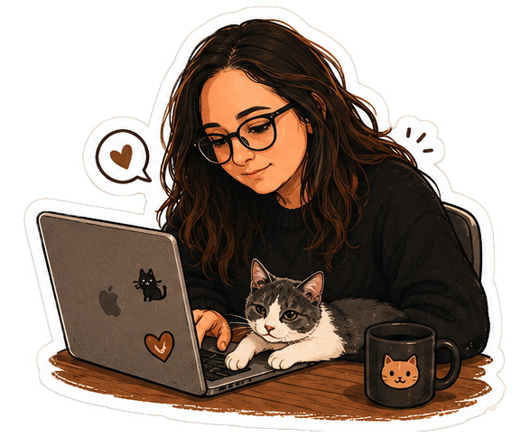

<div align="center">

<!-- BANNER - terminal look, hand-drawn SVG. Edit assets/banner.svg directly if querés cambiar el texto. -->


<br>

<a href="https://github.com/VicDW43">
  
</a>

<br><br>

<a href="https://www.linkedin.com/in/victoriadewinne/"></a>&nbsp;&nbsp;
<a href="mailto:vickydewinne@gmail.com"></a>

<br><br>


</div>

<div align="center">

</div>

## Sobre mí ✨



¡Hola! Soy Victoria 👋 Vengo del mundo administrativo y del diseño, y hace un tiempo decidí meterme de lleno en el desarrollo de software, sin dejar ninguna de las dos cosas atrás.

- 🎓 Estudiante de la **Tecnicatura Universitaria en Programación** (UTN), con promedio sostenido entre 8 y 10.
- 🎨 Antes de programar, diseñaba: hice el curso de **Diseño UX/UI en Coderhouse** y todavía subo proyectos a mi Behance.
- 🐍 Sumando **Python** a través de Talento Tech (Gobierno de la Ciudad de Buenos Aires) y dando mis primeros pasos en IA aplicada.
- 🏥 Varios años de experiencia real gestionando datos, sistemas y atención al público en centros de salud.
- 🔍 Buscando mi primera oportunidad como **Programadora Junior / Trainee** para sumar esta base técnica a un equipo real.

```js
const victoria = {
  rol: "Programadora Junior / Trainee",
  ubicacion: "Buenos Aires, Argentina",
  formacion: ["UTN", "Coderhouse (UX/UI)", "Talento Tech (Python)"],
  stack: ["JavaScript", "Python", "C#", "C++", "SQL"],
  ojoDeDiseñadora: true,
  buscando: "primera oportunidad como dev junior",
};
```

<br>


<div align="center">

## Mi stack 🛠️


<br><br>

&nbsp;&nbsp;
&nbsp;&nbsp;


</div>

## Portfolio 🎨

Antes del código estuvo el diseño, y todavía convive con él. En mi Behance vas a encontrar proyectos de UX/UI como el rediseño de la app de Starbucks o Nanny Pet: la otra mitad de cómo pienso los productos digitales, primero la experiencia de usuario y después la lógica que la sostiene.

<div align="center">
<a href="https://www.behance.net/vickydewinne"></a>
</div>

<div align="center">

</div>


<div align="center">

<sub>Hecho con 🖤 y muchas ganas de aprender · <a href="https://github.com/VicDW43">@VicDW43</a></sub>

</div>
